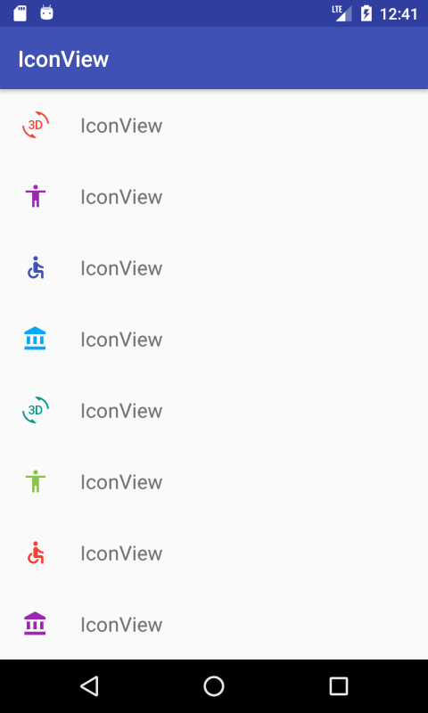

# IconView
One image resource for multiple colors

[](http://search.maven.org/#search|ga|1|g%3A%22ru.noties%22%20AND%20a%3A%22iconview%22)

Simple one-class library for applying different colors to one image resource.





```xml
<ru.noties.iconview.IconView
    android:id="@+id/icon_view"
    android:layout_width="48dip"
    android:layout_height="48dip"
    android:scaleType="centerInside"
    app:iv_color="#FF0"/>
```

```java
final IconView iconView = (IconView) findViewById(R.id.icon_view);
iconView.setColor(ContextCompat.getColor(this, R.color.colorAccent));
```

Underneath it just uses `ProterDuffColorFilter` with `MULTIPLY` mode, so **solid white** image resources are a good fit. If you want to change porter duff mode add attribute to your layout definition via: `app:iv_mode="src_atop"` or Java: `iconView.setMode(PorterDuff.Mode.SRC_ATOP)`

## License

```
  Copyright 2017 Dimitry Ivanov (mail@dimitryivanov.ru)

  Licensed under the Apache License, Version 2.0 (the "License");
  you may not use this file except in compliance with the License.
  You may obtain a copy of the License at

      http://www.apache.org/licenses/LICENSE-2.0

  Unless required by applicable law or agreed to in writing, software
  distributed under the License is distributed on an "AS IS" BASIS,
  WITHOUT WARRANTIES OR CONDITIONS OF ANY KIND, either express or implied.
  See the License for the specific language governing permissions and
  limitations under the License.
```